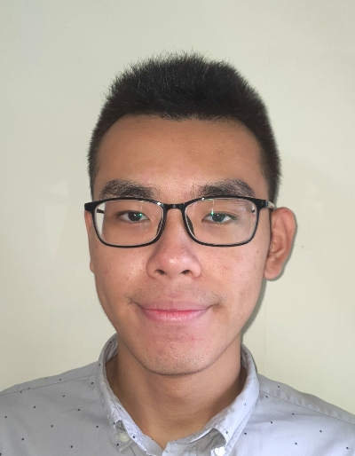
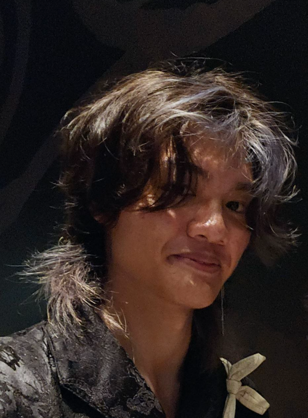
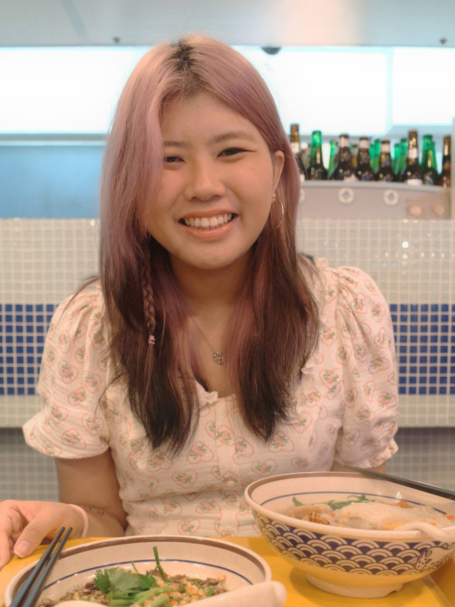
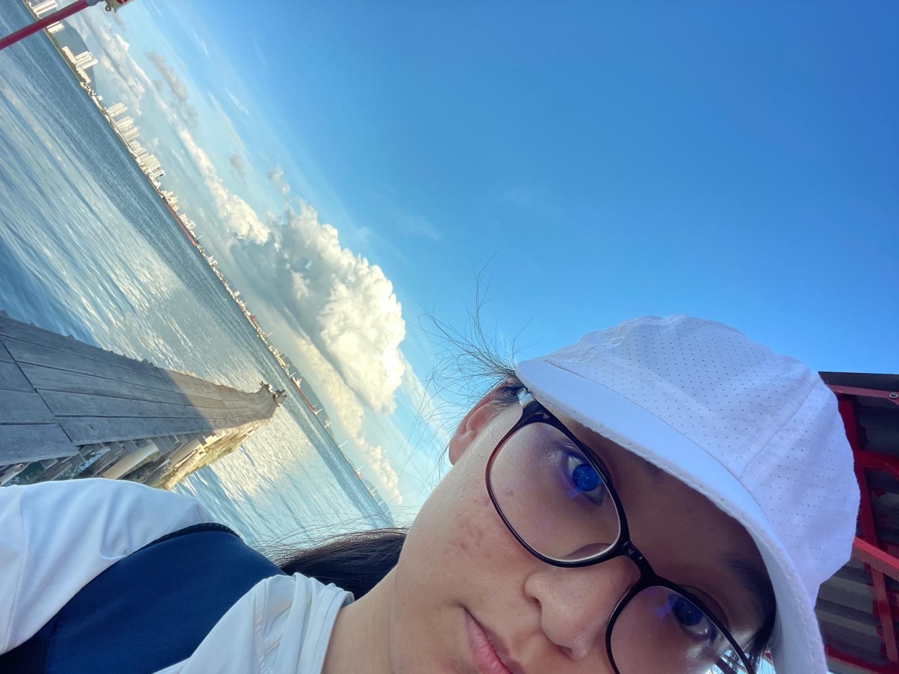
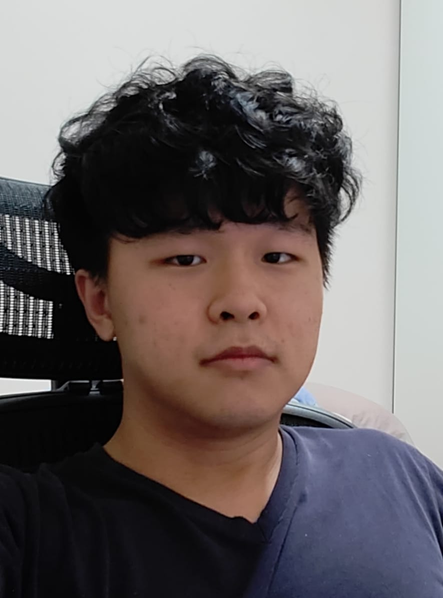

# About Us

We are a team based in the [School of Computing, National University of Singapore](http://www.comp.nus.edu.sg).

You can reach us at the email `seer[at]comp.nus.edu.sg`

## Project team

### Hugo Chia

[[github](https://github.com/hugo-chia)]
[[portfolio](team/hugochia.md)]

* Role: Team lead, Scheduling and tracking

### Lucas Lim

[[github](http://github.com/Codekrodile)]
[[portfolio](team/codekrodile.md)]

* Role: Documentation
* Responsibilities: UI

### Reanee Chua

[[github](https://github.com/reaneechua)] [[portfolio](team/reaneechua.md)]

* Role: Code Quality
* Responsibilities:  Looks after code quality, ensures adherence to coding standards, etc.

### Cheng Anqi, Angel

[[github](http://github.com/AerollingOverDeepBlueSeas)]
[[portfolio](team/aerollingoverdeepblueseas.md)]

* Role: Developer
* Responsibilities: Dev Ops + Threading

### Cao Yitian

[[github](http://github.com/UltimateHG)]
[[portfolio](team/UltimateHG.md)]

* Role: Testing
* Responsibilities: Testing for project
