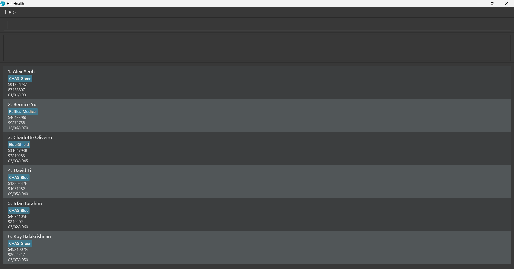

# HubHealth User Guide

HubHealth is built for you, clinic receptionists. HubHealth allows you to manage your patient’s contact and appointments with simple keyboard commands.

<!-- * Table of Contents -->
<page-nav-print />

## Table of contents

--------------------------------------------------------------------------------------------------------------------

## Quick start

1. Ensure you have Java `17` or above installed in your Computer. This is required to run HubHealth.  
   - **Checking whether you have Java installed/ the right Java version:** 
     - **Windows users:** Press the Windows key, or use the Start menu to search for `Java`. If there are no results that lead to an application. You do not have Java installed. Otherwise, click on `About Java`, and it show you the version of Java currently downloaded on your computer. 
     - **Mac users:** Open a new Terminal window, and enter `java -version`. Hit enter and you should see the Java version downloaded on your computer. 
   - **Installing Java:** If you do not have Java installed or do not have the right version, follow the instructions [here](https://www.java.com/en/download/help/download_options.html) to download Java `17`.  
     - **Mac users:** Ensure you have the precise JDK version prescribed [here](https://se-education.org/guides/tutorials/javaInstallationMac.html).

1. Download the latest `.jar` file from [here](https://github.com/AY2425S2-CS2103T-F11-1/tp/releases). This is the HubHealth application.

1. Copy the file to the folder you want to use as the _home folder_ for HubHealth.

1. Open a command terminal, and enter `cd <directory>`, where `<directory>` is the path to the folder you put the jar file in.  
  For instance, if the application is in the Downloads folder, the command you enter should look something like `cd
 C:\Users\user\Downloads` 
   (You can find the location of the application by right-clicking on it, and selecting `Properties` or `Get info` for Windows and Mac users.)

2. Next, enter the command `java -jar addressbook.jar` and press Enter to start the application. 
   A GUI similar to the below should appear in a few seconds. Note how the app contains some sample data. 
   

1. Type the command in the command box and press Enter to execute it. e.g. typing **`help`** and pressing Enter will open the help window. 
   Some example commands you can try:

   * `list` : Lists all patients recorded in HubHealth.

   * `add -N John Doe -P 98765432 -IC S1234567A` : Adds a patient named `John Doe` to HubHealth.

   * `delete -IC <NRIC>` : Deletes the patient with the given NRIC.

   * `clear` : Deletes all patients recorded in HubHealth.

   * `exit` : Exits the app.

1. Refer to the [Features](#features) below for details of each command.

--------------------------------------------------------------------------------------------------------------------

## Features

<box type="info" seamless>

**Notes about the command format:** 

* Words in `<>` are the parameters to be supplied by the user. 
  e.g. in `add -IC <NRIC> -N <Name> -P <Phone_Number> -DOB <Date_Of_Birth>`, `<Name>` is a parameter which can be used as `add -N John Doe`.

* Parameters can be in any order. 
  e.g. if the command specifies `-N <Name> -P <Phone_Number>` in the command format, `-P <Phone_Number> -N <Name>` is also acceptable.

* Items in square brackets are optional. 
  e.g `find <Name> [MORE_NAMES]` can be used as `find Alex` or as `find Alex David`.

* Extraneous parameters for commands that do not take in parameters (such as `help`, `list`, `ls`, `exit` and `clear`) will be ignored. 
  e.g. if the command specifies `help 123`, it will be interpreted as `help`.

* If you are using a PDF version of this document, be careful when copying and pasting commands that span multiple lines as space characters surrounding line-breaks may be omitted when copied over to the application.
</box>

### Viewing help : `help`

Shows you a message explaining how to access the help page.

Format: `help`

### Adding a patient: `add`

Allows you to add a new patient to the address book.

Format: `add -IC <NRIC> -N <Name> -P <Phone_Number> -DOB <Date_Of_Birth>`

Examples:
* `add -IC T0000000A -N John Doe -P 81234567 -DOB 2005-02-02`

### Listing all patients : `list`

Shows you a list of all patients in the address book.

Format: `list`

<box type="tip" seamless>

**Tip:** You can also use `ls` to list all patients in the address book.
</box>

### Locating patients by name: `find`

Allows you to search for patients whose names contains a given name.

Format: `find <Name> [MORE_NAMES]`

* The search is case-insensitive. e.g `hans` will match `Hans`
* The order of the keywords does not matter. e.g. `Hans Bo` will match `Bo Hans`
* Only the name is searched.
* Only full words will be matched e.g. `Han` will not match `Hans`
* Patients whose name is matching with at least one keyword will be returned (i.e. `OR` search).
  e.g. Finding `Hans Bo` will return `Hans Gruber`, `Bo Yang`

Examples:
* `find John` returns `john` and `John Doe`
* `find alex david` returns `Alex Yeoh`, `David Li` 

### Viewing patient details

Displays all patient details to you.

Format: viewp -IC <NRIC>

Examples:
* `viewp -IC T01234567X` displays all the details of the patient whose IC is T01234567X

### Removing a patient : `remove`

Allows you to remove the specified patient from HubHealth.

Format: `remove -IC <NRIC>`

* Deletes the patient with the specified `<NRIC>`.

### Clearing all entries : `clear`

Clears all entries from HubHealth.

Format: `clear`

<box type="tip" seamless>
A useful first step to creating your own patient record: Deleting the existing sample data.
</box>

<box type="warning" seamless>
We do not support undoing commands yet. Clearing of patient records is thus permanent. Use this command wisely.
</box>

### Exiting the program : `exit`

Allow you to exit the program.

Format: `exit`

### Saving the data

AddressBook data are saved in the hard disk automatically after any command that changes the data. There is no need to save manually.

### Editing the data file

AddressBook data are saved automatically as a JSON file `[JAR file location]/data/addressbook.json`. Advanced users are welcome to update data directly by editing that data file.

<box type="warning" seamless>
If your changes to the data file makes its format invalid, AddressBook will discard all data and start with an empty data file at the next run.  Hence, it is recommended to take a backup of the file before editing it. 
Furthermore, certain edits can cause the AddressBook to behave in unexpected ways (e.g., if a value entered is outside the acceptable range). Therefore, edit the data file only if you are confident that you can update it correctly.
</box>

--------------------------------------------------------------------------------------------------------------------

## FAQ

**Q**: Can I use HubHealth on multiple computers? 
**A**: No, HubHealth is built for private clinics who are moving to digital-based processes for the first time. 
HubHealth is meant to be simple, and runs in a standalone environment, and does not support multiple computers.

**Q**: How do I transfer my data to another Computer? 
**A**: Install HubHealth in the other computer and overwrite the empty data file it creates with the file that contains 
the data of your previous AddressBook home folder.

**Q**: Can I undo a command if I make a mistake? 
**A**: No, the undo feature is currently not supported. 

--------------------------------------------------------------------------------------------------------------------

## Known issues

1. **When using multiple screens**, if you move the application to a secondary screen, and later switch to using only the primary screen, the GUI will open off-screen. The remedy is to delete the `preferences.json` file created by the application before running the application again.
2. **If you minimize the Help Window** and then run the `help` command (or use the `Help` menu, or the keyboard shortcut `F1`) again, the original Help Window will remain minimized, and no new Help Window will appear. The remedy is to manually restore the minimized Help Window.

--------------------------------------------------------------------------------------------------------------------

## Command summary

Action     | Format, Examples
-----------|----------------------------------------------------------------------------------------------------------------------------------------------------------------------
**Add**    | `add -IC <NRIC> -N <Name> -P <Phone_Number> -DOB <Date_of_Birth>  ` e.g., `add -IC T0000000A -N John Doe -P 81234567 -DOB 2005-02-02`
**Remove** | `remove -IC <NRIC>`
**View Patient** | `viewp -IC <NRIC>`
**Find**   | `find <Name> [MORE_NAMES]`  e.g., `find James Jake`
**Clear**  | `clear`
**List**   | `list`, `ls`
**Help**   | `help`
