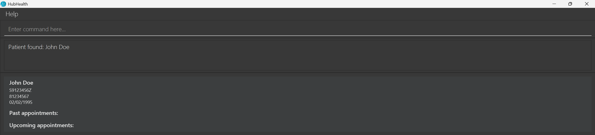
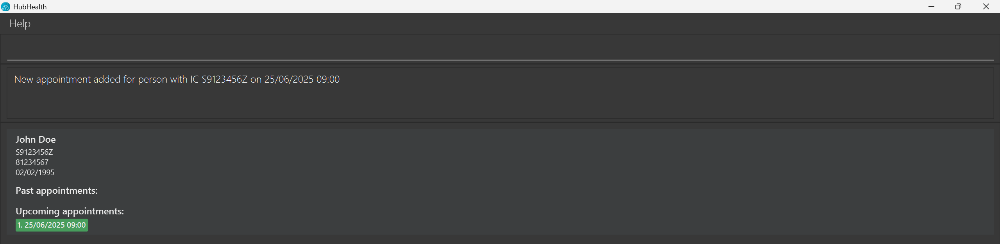
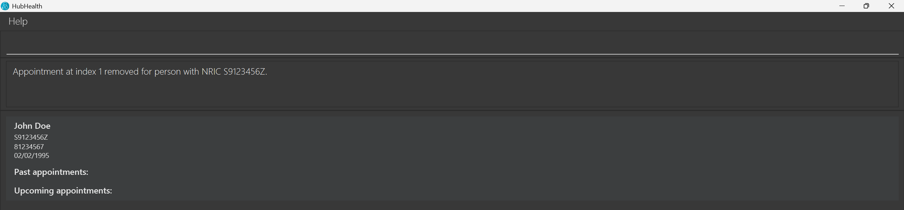

# HubHealth User Guide

## About HubHealth
Introducing HubHealth, a **Clinic Appointment Management System** designed to empower **Singaporean clinic 
receptionists** to **manage patient information** and **schedule appointments** efficiently. As a clinic receptionist,
you can easily manage patient records (including name, birth date, contact information, etc.) and track past and
upcoming appointments with simple keyboard commands. Additionally, the **tagging system** allows you to tag
government-related subsidies (such as CHAS) or insurance information to your patient, simplifying patient management.

If you are unfamiliar with any terminology in the HubHealth User Guide, refer to the [Glossary](#7-glossary).

## Table of contents
  * [About HubHealth](#about-hubhealth)
  * [Table of contents](#table-of-contents)
  * [1. Quick start](#1-quick-start)
    * [1.1 Installation](#1-1-installation)
    * [1.2 Getting started](#1-2-getting-started)
  * [2. Features](#2-features)
    * [2.1 Patient management](#2-1-patient-management)
      * [2.1.1 Listing all patients : `list`](#2-1-1-listing-all-patients-list)
      * [2.1.2 Locating patients by name: `find`](#2-1-2-locating-patients-by-name-find)
      * [2.1.3 Adding a patient: `add`](#2-1-3-adding-a-patient-add)
      * [2.1.4 Removing a patient : `remove`](#2-1-4-removing-a-patient-remove)
    * [2.2 Appointment management (for patient)](#2-2-appointment-management-for-patient)
      * [2.2.1 Viewing patient details : `viewp`](#2-2-1-viewing-patient-details-viewp)
      * [2.2.2 Adding appointment to patient : `addappt`](#2-2-2-adding-appointment-to-patient-addappt)
      * [2.2.3 Removing appointment from patient : `rmappt`](#2-2-3-removing-appointment-from-patient-rmappt)
    * [2.3 HubHealth general features](#2-3-hubhealth-general-features)
      * [2.3.1 Viewing help : `help`](#2-3-1-viewing-help-help)
      * [2.3.2 Clearing all entries : `clear`](#2-3-2-clearing-all-entries-clear)
      * [2.3.3 Exiting HubHealth : `exit`](#2-3-3-exiting-hubhealth-exit)
    * [2.4 Coming soon](#2-4-coming-soon)
    * [2.5 Saving the data](#2-5-saving-the-data)
    * [2.6 Editing the data file](#2-6-editing-the-data-file)
    * [2.7 Backing up the data file](#2-7-backing-up-the-data-file)
  * [3. FAQ](#3-faq)
  * [4. Known issues](#4-known-issues)
  * [5. Parameter Constraint Table](#5-parameter-constraint-table)
  * [6. Command summary](#6-command-summary)
  * [7. Glossary](#7-glossary)

--------------------------------------------------------------------------------------------------------------------

## 1. Quick start
This section provides a quick start to HubHealth. If HubHealth is already installed on your computer, you may 
skip the Installation and jump to [Getting started](#1-2-getting-started).

### 1.1 Installation

1. Download the latest release (`HubHealth.jar`) from [here](https://github.com/AY2425S2-CS2103T-F11-1/tp/releases). This is the HubHealth application.

### 1.2 Getting started

1. Copy the app (`HubHealth.jar`) to the folder you want to use as the _home folder/base folder_ for HubHealth. 

1. Double click the downloaded file `HubHealth.jar` to start HubHealth. 
   - HubHealth should appear in a few seconds as seen in the screenshot below. Note how HubHealth contains some sample 
     data. 
   

1. Type the command in the command box and press Enter to execute it. e.g. typing **`help`** and pressing Enter will open the help window. 
   Some example commands you can try:

   * `list` : Lists all patients recorded in HubHealth.

   * `add -N John Doe -P 98765432 -IC S9123456Z -DOB 03/10/1998` : Adds a patient named `John Doe` to HubHealth.

   * `remove -IC S9123456Z` : Removes the patient with the NRIC `S9123456Z`.

   * `clear` : Removes all patients recorded in HubHealth.

   * `exit` : Exits the app.

1. Refer to the [Features](#2-features) section for details of each command.

<box type="info" seamless class="info-custom">

**Note:** ONLY IF any of the above steps ([1.2 Getting started](#1-2-getting-started)) do not work, you may need to follow the instructions below:

1. Ensure you have Java `17` or above installed in your Computer. This is required to run HubHealth.  
    - **Checking whether you have the right version of Java installed:** 
      - **Windows users:** Press the Windows key, or use the Start menu to search for `Java`. If there are no 
        results that lead to an application, you do not have Java installed. Otherwise, click on `About Java`, and 
        it will show you the version of Java currently downloaded on your computer. 
      - **Mac users:** Open a new Terminal window, and enter `java -version`. Hit enter and you should see the Java version downloaded on your computer. 
    - **Installing Java:** If you do not have Java installed, or do not have the right version...
      - **Linux users:** Follow the instructions [here](https://se-education.org/guides/tutorials/javaInstallationLinux.html) to install Java 17.
      - **Mac users:** Follow the instructions [here](https://se-education.org/guides/tutorials/javaInstallationMac.html) to install Java 17.
      - **Windows users:** Follow the instructions [here](https://se-education.org/guides/tutorials/javaInstallationWindows.html) to install Java 17.
    - **Mac users:** Even if you have Java installed, ensure you have the precise JDK version prescribed [here](https://se-education.org/guides/tutorials/javaInstallationMac.html).

1. Open a command terminal (e.g. `cmd.exe`, `PowerShell.exe`, etc.), and enter `cd <directory>`, where `<directory>` is the path to the folder you put the jar file in.  
   - For instance, if HubHealth is in the Downloads folder, the command you enter should look something like `cd 
   C:\Users\user\Downloads` 
   - (You can find the directory of HubHealth by right-clicking on it, and selecting `Properties` or `Get info` for 
     Windows and Mac users.)

1. Next, enter the command `java -jar HubHealth.jar` and press Enter to start HubHealth. 

</box>

--------------------------------------------------------------------------------------------------------------------

## 2. Features

<box type="info" seamless class="info-custom">

**Notes about the command format:** 

* Words in `<>` are the parameters to be supplied by the user. 
  e.g. in `add -IC <NRIC> -N <Name> -P <Phone_Number> -DOB <Date_Of_Birth>`, `<Name>` is a parameter which can be used as `add -N John Doe`.

* Parameters can be in any order. 
  e.g. if the command specifies `-N <Name> -P <Phone_Number>` in the command format, `-P <Phone_Number> -N <Name>` is also acceptable.

* Items in square brackets are optional. 
  e.g `find <Name> [MORE_NAMES]` can be used as `find Alex` or as `find Alex David`.

* Extraneous parameters for commands that do not take in parameters (such as `help`, `list`, `ls`, `exit` and `clear`) will be ignored. 
  e.g. if the command specifies `help 123`, it will be interpreted as `help`.

* If you are using a PDF version of this document, be careful when copying and pasting commands that span multiple 
  lines as certain characters (i.e. whitespace) surrounding line-breaks may be omitted when copied over to HubHealth, 
  resulting in the copied command not working.
</box>

### 2.1 Patient management

#### 2.1.1 Listing all patients : `list`

Shows you a list of all patients in HubHealth.

Format: `list` or `ls`

Example:
- `list` will display a list of patients currently saved in HubHealth

#### 2.1.2 Locating patients by name: `find`

Allows you to search for patients whose names contains a given name.

Format: `find <Name> [MORE_NAMES]`

* The search is case-insensitive. e.g `hans` will match `Hans`
* The order of the keywords does not matter. e.g. `Hans Bo` will match `Bo Hans`
* Only the name is searched
* Partial words will be matched e.g. `Han` will match `Hans`
* Patients whose name is matching with at least one keyword will be returned (i.e. `OR` search)
  e.g. Finding `Hans Bo` will return `Hans Gruber`, `Bo Yang`

Examples:
* `find John` returns `john` and `John Doe`
* `find alex david` returns `Alex Yeoh`, `David Li` 

#### 2.1.3 Adding a patient: `add`

Allows you to add a new patient to HubHealth.

Format: `add -IC <NRIC> -N <Name> -P <Phone_Number> -DOB <Date_Of_Birth> [-T <Tag> [-T <MORE_TAGS>]]`

Examples:
* `add -IC S9123456Z -N John Doe -P 81234567 -DOB 02/02/1995` will add a patient with name `John Doe`, NRIC 
  `S9123456Z`, phone number `81234567` and date of birth `2nd Feb 1995` to HubHealth
* `add -IC S9123456Z -N John Doe -P 81234567 -DOB 02/02/1995 -T CHAS-Blue -T Raffles-Medical` will add the same patient 
  as the example above, with the additional tags of `CHAS-Blue` and `Raffles-Medical`, to HubHealth

<box type="info" seamless class="info-custom">

**Notes about NRIC when adding a patient:** 

* NRIC is used to identify a unique patient. In addition, HubHealth **does not** allow two patients to share the 
  **same name and phone number**, even if they have different NRIC.

* You should note that NRIC checksum verification is not implemented as the current level of validation is deemed 
  sufficient. You may refer to [5. Parameter Constraint Table](#5-parameter-constraint-table) for more information.

</box>

<box type="tip" seamless class="tip-custom">

Pro tip: Alphabets in NRIC are case-insensitive. The following (non-exhaustive) may be accepted `S9123456Z`, 
`s9123456z`, `S9123456z`.

</box>

#### 2.1.4 Removing a patient : `remove`

Allows you to remove the specified patient from HubHealth.

Format: `remove -IC <NRIC>` or `rm -IC <NRIC>`

* Deletes the patient with the specified `<NRIC>`

Example:
* `remove -IC S9123456Z` removes the patient with the NRIC S9123456Z

<box type="info" seamless class="info-custom">

**Notes about NRIC when removing a patient:** 

* You must use the `-IC` command format as this ensures you will not accidentally delete another patient's information.
* This applies to other commands that use `-IC` as well.

  </box>

 
 

### 2.2 Appointment management (for patient)
<box type="info" seamless class="info-custom">

**Managing patient appointments:** 

* When managing a specific patient (i.e. using the following commands: `viewp`, `addappt`, `rmappt`), you will be 
  brought to a different page displaying all the appointments of **only one patient**.

  </box>
<box type="tip" seamless class="tip-custom">

Use `list` or `ls` to go back to the main window to **view all patients**.

</box>

#### 2.2.1 Viewing patient details : `viewp`

Shows you the details of a patient.

Format: `viewp -IC <NRIC>`

Example:
* `viewp -IC S9123456Z` shows details of the patient with the NRIC S9123456Z

In the screenshot above, we can see that this patient has no past or upcoming appointments.

#### 2.2.2 Adding appointment to patient : `addappt`

Allows you to create an appointment at a specified starting time for a patient.

Format: `addappt -IC <NRIC> -D <date in dd/MM/yyyy HH:mm>`

Example:
* `addappt -IC S9123456Z -D 25/06/2025 09:00` creates an appointment on 25 June 2025 at 9:00am for the patient with the NRIC S9123456Z

In the screenshot above, we can see that a new upcoming appointment has been added for this patient. You can also 
see the date and time for this appointment.

<box type="warning" seamless class="warning-custom">

A patient cannot have more than one appointment starting at the same time.

</box>

#### 2.2.3 Removing appointment from patient : `rmappt`

Allows you to remove an appointment from a patient at the specified index.

Format: `rmappt -IC <NRIC> -I <index in appointment list>`

Example:
* `rmappt -IC S9123456Z -I 1` removes the appointment with index 1 from the patient with the NRIC S9123456Z

In the screenshot above, we can see that the first appointment (added using the example `addappt` command above) has 
been removed for this patient. This patient now has no more appointments.

<box type="tip" seamless class="tip-custom">

Use `viewp` first to view the appointment list of a specified patient.

</box>

<box type="warning" seamless class="warning-custom">

We currently do not support editing appointments yet. To make changes, please delete the existing appointment and create a new one with the updated start time.

</box>

 
 

### 2.3 HubHealth general features

#### 2.3.1 Viewing help : `help`

Shows you a message explaining how to access the help page. The URL shown can be copied via the `Copy URL` button, 
and pasted into a browser to access the help page.

Format: `help`

Example:
* `help` will open a message window as shown in the above screenshot

#### 2.3.2 Clearing all entries : `clear`

Clears all entries from HubHealth.

Format: `clear`

Example:
* `clear` will clear all patients, leaving HubHealth with an empty patient list

<box type="tip" seamless class="tip-custom">
A useful first step to creating your own patient record: Deleting the existing sample data.
</box>

<box type="warning" seamless class="warning-custom">

We do not support undoing commands yet. Clearing of patient records is thus permanent. If you are worried about 
losing your data, you may refer to [2.7 Backing up the data file](#2-7-backing-up-the-data-file) to back up your 
data. Use this command wisely.

</box>

#### 2.3.3 Exiting HubHealth : `exit`

Allows you to exit HubHealth.

Format: `exit`

Example:
* `exit` will close the HubHealth application

<box type="tip" seamless class="tip-custom">
You may close HubHealth as you would normally close any other application (i.e. by clicking 'x' on the top left/right 
corner). This command only exists in case closing HubHealth normally does not work.
</box>

 
 

### 2.4 Coming soon
1. Allow “/” and other special characters in patient name
   * Name currently only supports alphanumeric characters and spaces, and does not support characters such as “/”, 
     “@” (list is non-exhaustive) 
   * For example, the name “Ravi S/O Ramasamy” will not be allowed 
   * Support for “/”, “@” and other special characters used in the name will be added in a future release

 

2. Allow editing of patient information
   * For example, allow phone number and tags (tracking patient’s CHAS information, insurance information etc.) to be 
   editable
   * However, a patient’s NRIC and Date of Birth will remain un-editable once a patient has been created

 

3. Allow name searches to match only names that start with any of the keywords
   * The `find` command currently returns patients whose name contain any of the keywords in any part of their name
   * For example, `find Le` can return patients named "Levanne" and "Violet"
   * This search may be refined to only return patients whose name starts with a keyword in a future release

 

4. Allows undoing of commands in the current session
   * There is no current method of undoing any wrong commands, including potentially destructive commands such as removing a patient or an appointment
   * This allows for users to roll back the application in case any command has been mistakenly executed

 
 

### 2.5 Saving the data

HubHealth data are saved in the hard disk automatically after any command that changes the data. There is no need to save manually.

 
 

### 2.6 Editing the data file

HubHealth data are saved automatically as a JSON file in `[Home folder]/data/HubHealth.json`. **Advanced users** are 
welcome to update data directly by editing that data file.

<box type="warning" seamless class="warning-custom">
If your changes to the data file makes its format invalid, HubHealth will discard all data and start with an empty data file at the next run.  Hence, it is recommended to take a backup of the file before editing it. 
Furthermore, certain edits can cause the HubHealth to behave in unexpected ways (e.g., if a value entered is outside the acceptable range). Therefore, edit the data file only if you are confident that you can update it correctly.
</box>

 
 

### 2.7 Backing up the data file

HubHealth data are saved automatically as a JSON file in `[Home folder]/data/HubHealth.json`. Users who wish to 
perform periodic backup of the data, may make a copy of the file and store the file in another location, such as 
another folder on the computer or on a thumbdrive.

--------------------------------------------------------------------------------------------------------------------

## 3. FAQ

**Q**: Can I use HubHealth on multiple computers? 
**A**: No, HubHealth is built for private clinics who are moving to digital-based processes for the first time. 
HubHealth is meant to be simple, and runs in a standalone environment, and does not support multiple computers.

**Q**: How do I transfer my data to another Computer? 
**A**: Install HubHealth in the other computer and overwrite the empty data file it creates with the file that contains 
the data of your previous HubHealth home folder.

**Q**: Can I undo a command if I make a mistake? 
**A**: No, the undo feature is currently not supported. 

--------------------------------------------------------------------------------------------------------------------

## 4. Known issues

1. **When using multiple screens**, if you move HubHealth to a secondary screen, and later switch to using only
the primary screen, the GUI will open off-screen. The remedy is to delete the `preferences.json` file created by 
   HubHealth before running HubHealth again.
 
**Windows users:** Alternatively, you may press the `Windows Key` + `Right-Arrow Key` to bring HubHealth back into 
   the primary screen.

2. **If you minimize the Help Window** and then run the `help` command (or use the `Help` menu, or the keyboard shortcut `F1`) again, the original Help Window will remain minimized, and no new Help Window will appear. The remedy is to manually restore the minimized Help Window.

--------------------------------------------------------------------------------------------------------------------

## 5. Parameter Constraint Table

| Parameter | Parameter Representation/Full Name                                                                                                                                         | Requirement (Commands)                                        | Constraint                                                                                                                                                                                                                                                                                                                                                                                                                                        |
|-----------|----------------------------------------------------------------------------------------------------------------------------------------------------------------------------|---------------------------------------------------------------|---------------------------------------------------------------------------------------------------------------------------------------------------------------------------------------------------------------------------------------------------------------------------------------------------------------------------------------------------------------------------------------------------------------------------------------------------|
| **IC**    | Identity Card Number (NRIC) (of Patient)                                                                                                                                   | Compulsory   `add`, `remove`, `viewp`, `addappt`, `rmappt` | NRIC should only contain `alphanumeric characters`, `starting with S,T,F,G,M` followed by `7 digits`, and `ending with an alphabet`.    *A user may prefer to use lower case alphabets for the NRIC and it is accepted too (We support the feature but will not include it in the error message for brevity sake).    *Note that NRIC checksum verification is not implemented, as the current level of validation is sufficient. |
| **N**     | Name (of Patient)                                                                                                                                                          | Compulsory   `add`                                         | Name should only contain `alphanumeric characters` and `spaces`, and it should not be blank.    It must be at most `66 characters long`. Patients sharing the same phone number cannot share the same name.                                                                                                                                                                                                                              |
| **P**     | Phone Number (of Patient)                                                                                                                                                  | Compulsory   `add`                                         | Phone number may start with a `+`, and must contain `only numbers` thereafter.    It must be between `3 to 30 numbers long`.  Patients sharing the same name cannot share the same phone number.                                                                                                                                                                                                                                         |
| **DOB**   | Date of Birth (of Patient)                                                                                                                                                 | Compulsory   `add`                                         | Date of Birth should be in the format: `dd/MM/yyyy`. The year should be after 1900, and cannot be after today's date.                                                                                                                                                                                                                                                                                                                             |
| **I**     | Index (of Appointment)                                                                                                                                                     | Compulsory   `rmappt`                                      | Index should only be `a number`, and should be within the range of the appointments a patient has. 0 is not allowed.                                                                                                                                                                                                                                                                                                                              |
| **D**     | Date (of Appointment)                                                                                                                                                      | Compulsory   `addappt`                                     | Appointment date should be in the format: `dd/MM/yyyy HH:mm` and cannot be before today.                                                                                                                                                                                                                                                                                                                                                          |
| **T**     | Tag Name (a wildcard for clinic receptionist to add any useful tags necessary for work)    A suggested use case is adding CHAS/insurance information to the patient. | Optional   `add`                                           | Tag names must start with an `alphanumeric character`, may contain `-`, must not contain spaces.    It must be at most `30 characters long`.                                                                                                                                                                                                                                                                                                |

--------------------------------------------------------------------------------------------------------------------

## 6. Command summary
This section provides a summary of all commands that HubHealth provides. You may click on the command to go to the 
respective section for more detailed information regarding the command.

| Action                            | Format(s)                                                                                             |
|-----------------------------------|-------------------------------------------------------------------------------------------------------|
| Listing all patients              | [`list`, `ls`](#2-1-1-listing-all-patients-list)                                                      |
| Locating patients by name         | [`find <Name> [MORE_NAMES]`](#2-1-2-locating-patients-by-name-find)                                   |
| Adding a patient                  | [`add -IC <NRIC> -N <Name> -P <Phone_Number> -DOB <Date_Of_Birth>`](#2-1-3-adding-a-patient-add)      |
| Removing a patient                | [`remove -IC <NRIC>`, `rm -IC <NRIC>`](#2-1-4-removing-a-patient-remove)                              |
| Viewing patient details           | [`viewp -IC <NRIC>`](#2-2-1-viewing-patient-details-viewp)                                            |
| Adding appointment to patient     | [`addappt -IC <NRIC> -D <date in dd/MM/yyyy HH:mm>`](#2-2-2-adding-appointment-to-patient-addappt)    |
| Removing appointment from patient | [`rmappt -IC <NRIC> -I <index in appointment list>`](#2-2-3-removing-appointment-from-patient-rmappt) |
| Viewing help                      | [`help`](#2-3-1-viewing-help-help)                                                                    |
| Clearing all entries              | [`clear`](#2-3-2-clearing-all-entries-clear)                                                          |
| Exiting HubHealth                 | [`exit`](#2-3-3-exiting-hubhealth-exit)                                                               |

--------------------------------------------------------------------------------------------------------------------

## 7. Glossary

| Term                 | Meaning                                                                                                                                                                                                               |
|----------------------|-----------------------------------------------------------------------------------------------------------------------------------------------------------------------------------------------------------------------|
| **Alphanumeric**     | Consisting of or using both letters and numbers.                                                                                                                                                                      |
| **(File) Directory** | The path to the folder in which the specified file resides (viewable with right click -> Properties/Get Info).                                                                                                        |
| **GUI**              | The Graphical User Interface. This is what you see on the screen when you run most software. It has some visual/ graphical elements you can interact with (such as by clicking) without the use of keyboard commands. |
| **Home Folder**      | The folder in which HubHealth (i.e. `HubHealth.jar`) resides.                                                                                                                                                         |
| **IC/ NRIC**         | They are used interchangeably to refer to the National Registration Identity Card number. In the current release of HubHealth, NRIC is referred to as `IC` in the commands.                                           |
| **Patient/ Person**  | In the current release of HubHealth, any reference to a `Person` is interchangeable with a patient. A `Person` in HubHealth represents a patient and their information.                                               |

<!-- Created with ChatGPT -->
<a href="#top" style="
position: fixed;
bottom: 20px;
right: 20px;
width: 40px;
height: 40px;
background-color: #007acc;
color: white;
border-radius: 50%;
box-shadow: 0 2px 6px rgba(0,0,0,0.3);
text-align: center;
line-height: 40px;
font-size: 20px;
text-decoration: none;
z-index: 1000;
font-family: sans-serif;
">↑</a>
<!-- Created with ChatGPT -->
